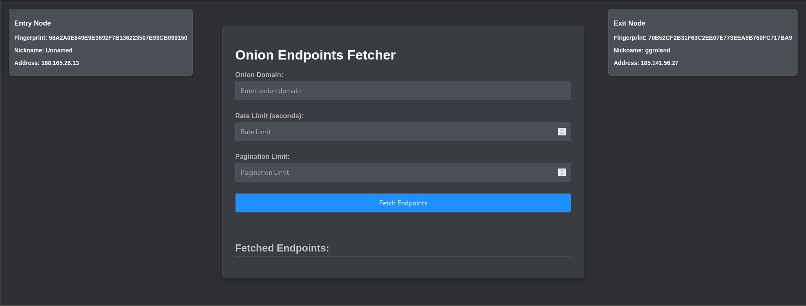

**Disclaimer:** This tool is intended for educational and research purposes only. Unauthorized use of this tool is prohibited. Use it responsibly and at your own risk.
</p>
<hr>

# 🤔 What is this?

**Onion Endpoints Fetcher** is a Python Flask-based web application designed for dark web exploration and investigation .

This tool helps cybersecurity researchers, analysts, and enthusiasts explore the hidden web, analyze the structure of onion sites, and gather information for investigative purposes while maintaining anonymity through TOR.



> **"What about anonymity?"**

That's the point. You don't need to worry about it now, our tool utilizes tor for anonymity and privacy, identifies entry and exit nodes while esthablishing a tor circuit, 
rebuild the tor circuit each time you run the tool and flush old circuits. 

# ✨ Features

- **Fetch Endpoints:** Extract endpoints from .onion domains.
- **Rate Limiting:** Customize rate limits to manage request frequencies.
- **Pagination:** Control the number of pages to fetch results from.
- **TOR Integration:** Leverage the TOR network to maintain privacy.
- **Live Updates:** View the current TOR entry and exit nodes.
- **File Saving:** Save the fetched endpoints into individual files named according to the domains(e.g., abcxyz.onion → abcxyz.txt).

## 📋 Requirements

- Python 3 [`sudo apt install python3`]
- Python3-pip [`sudo apt install python3-pip`]
- Flask
- Stem
- Requests
- BeautifulSoup
- Termcolor
- Tor [`sudo apt install tor`]
- Proxychains [`sudo apt install proxychains4`]

# 🚀 Getting Started

1.**Clone the Repository:**
```shell
git clone https://github.com/iqlipx/Onion_Endpoints_Fetcher.git
cd Onion_Endpoints_Fetcher
```
2.**Install Dependencies:**
```shell
pip install -r requirements.txt
```
3.**Run the Application:**
- Run with flask `flask run`
- Normal way with python3 `python3 app.py`

**If you encounter the error:**
```shell
  ERROR - An error occurred: Authentication failed: unable to read '/run/tor/control.authcookie' ([Errno 13] Permission denied: '/run/tor/control.authcookie')
 ```
**Use the run.sh script to start the application:**
```shell
  chmod +x run.sh
  ./run.sh
```
- The run.sh script will adjust the necessary permissions for the control.authcookie file and then start the Flask application.

4.**Access the Tool:**

Open your browser and navigate to http://localhost:5000 OR http://127.0.0.1:5000 to start using the Onion Endpoints Fetcher! 🖥️

# 🛠️ Usage


  
